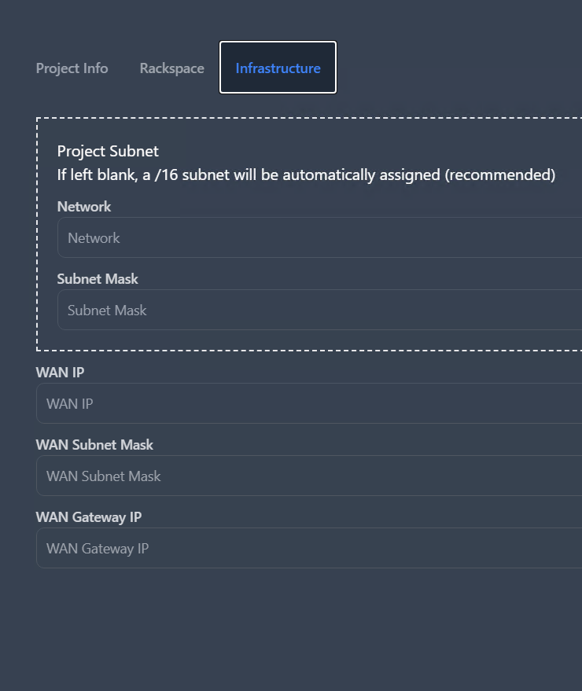

# Installation Guide

This guide will outline the requirements and installation procedure to
get the automation platform up and running. The guide will assume that
the user has a basic understanding of Linux and the command line as well
as Cisco ACI and VMware vCenter.

This solution is designed to allow a testing environment to provide OOB
connectivity to a variety of projects within a testing environment
through the use of a web UI. It achieves this through the use of Cisco
ACI and VMware vCenter. Each rack within the lab space must have its own
dedicated FEX or leaf switch as well as a terminal server, although a
rack can exist without either. When racks are selected to be part of a
project, the automation platform will deploy L2 connectivity to any FEX
and leaf that belong to the selected racks, as well as including the
terminal servers into this L2 domain. A virtual router will then be
deployed on vCenter which will have the same aforementioned L2
connectivity to the selected FEXs and leafs, as well as connectivity to
the desired WAN uplink.

## Requirements

-   Cisco ACI v5.2(4d)

-   VMware vCenter 7.0.3

-   ESXi 7.0.3 Host (at least one)

-   CSR1000v 17.03.05

-   Terminal Servers (Must be IOS-XE 17.06.03a)

The solution will require some existing ACI configuration to be in
place. The following will be required:

-   VMM integration between ACI and vCenter

-   EPGs for terminal servers, internet connectivity, virtual routers
    and management VMs.

    -   The virtual router EPG must have a DHCP server to automatically
        assign IP addresses to the virtual routers.

-   An EPG that has access to the virtual router and terminal server
    EPGs, access to ACI and vCenter APIs can either be in-band or
    out-of-band.

-   A static VLAN pool to be used by the automation platform, this
    should have a unique set of VLANs from any other VLAN pool to
    prevent issues from arising.

-   An interface selection policy per leaf/FEX should be created, as
    this will need to be associated with each node via the automation
    platform web UI.

An example design of both the physical deployment and the ACI
configuration can be seen in Figure
<a href="#fig:example-deployment" data-reference-type="ref"
data-reference="fig:example-deployment">1.1</a> and Figure
<a href="#fig:example-aci" data-reference-type="ref"
data-reference="fig:example-aci">1.2</a> respectively.

<figure id="fig:example-deployment">

<figcaption>Example physical deployment</figcaption>
</figure>

<figure id="fig:example-aci">

<figcaption>Example ACI configuration</figcaption>
</figure>

## ENV File Configuration

For the automation platform to operate correctly, the .env file must be
configured with the required information so that various services such
as ACI and vCenter can be accessed correctly. A breakdown of the
required .env file variables is provided below:

| **Variable**            | **Example**   | **Description**                                                                                                     |
|:-|:-|:----------------------------|
| APIC_IPADDR             | 192.168.0.125 | IP address of the APIC controller                                                                                   |
| APIC_USERNAME           | admin         | Username for the APIC controller                                                                                    |
| APIC_PASSWORD           | password      | Password for the APIC controller                                                                                    |
| ACI_POD                 | 1             | The pod number of the ACI fabric that the automation platform will automate                                         |
| ACI_VMWARE_DOMAIN       | ACI-DVS       | The name of the VMM integration domain                                                                              |
| ACI_INFRA_DOMAIN        | InfraPhys     | The name of the physical domain used to connect terminal servers to the ACI fabric                                  |
| ENHANCED_LACP           | LACP          | Name of the enhanced LACP policy used to connect ESXi nodes, leave this null if Enhanced LACP is not being utilised |
| VSPHERE_IPADDR          | 192.168.0.128 | IP address of the vCenter server                                                                                    |
| VSPHERE_USERNAME        | admin         | Username for the vCenter server                                                                                     |
| VSPHERE_PASSWORD        | password      | Password for the vCenter server                                                                                     |
| PROJECT_ROUTER          | ProjectRouter | Name of the virtual router VM template                                                                              |
| PROJECT_ROUTER_USERNAME | automation    | Username that will be used to connect to virtual router VM                                                          |
| PROJECT_ROUTER_PASSWORD | password      | Password that will be used to connect to virtual router VM                                                          |

## Virtual Router Template

The virtual router template should be a powered off VM not a template,
this is due to a limitation in the vCenter REST API. The VM should have
the following interface assignments:

| **Interface**     | **Port Group**                            |     |
|:------------------|:------------------------------------------|:----|
| Network Adapter 1 | quarantine                                |     |
| Network Adapter 2 | Internet EPG                              |     |
| Network Adapter 3 | Virtual Router Management EPG (with DHCP) |     |

Network adapter 1 will automatically be assigned to the project EPG by
the automation scripts. The automation script will automatically
configure NAT, default route and WAN IP address, so only the 3rd network
adapter needs to be configured to retrieve its IP address from DHCP.
RESTCONF will also need to be enabled, sample configuration is shown
below.

    vrf definition Mgmt
     address-family ipv4
     exit-address-family
    !
    interface GigabitEthernet3
     vrf forwarding Mgmt
     ip address dhcp
     negotiation auto
     no mop enabled
     no mop sysid
    !
    ip forward-protocol nd
    ip http server
    ip http authentication local
    ip http secure-server
    ip http secure-port 1025
    restconf

Additional ACLs should be configured to secure access to RESTCONF,
however, these will depend on the specific environment and deployment.
Once the initial configuration is complete, the VM should be powered off
and left in the desired folder where the project routers will be stored.

## Solution Deployment

In the future, the solution will be packaged via Docker Compose, which
will allow one command to be run to install and serve the solution as a
whole. With ACI and vCenter configured, the automation platform can be
deployed. The platform will need Docker running ideally ontop of a Linux
host, however, it can be deployed on Windows using Docker Desktop.
NodeJS and NPM will also be required to build and serve the frontend.
The following steps will need to be completed to deploy the platform:

1.  Clone the repository from GitHub

2.  Configure the .env file with the required information

3.  Run the following command in the backend folder to obtain the
    required composer dependencies:

            docker run --rm \
                -u "$(id -u):$(id -g)" \
                -v "$(pwd):/var/www/html" \
                -w /var/www/html \
                laravelsail/php82-composer:latest \
                composer install --ignore-platform-reqs

4.  Run the following command in the backend folder to start the
    platform:

            ./vendor/bin/sail up -d
            ./vendor/bin/sail artisan key:generate
            ./vendor/bin/sail artisan migrate
            ./vendor/bin/sail artisan queue:listen --timeout 400

5.  Run the following command in the frontend folder to obtain the
    required node dependencies:

            npm install
            npm run build
            npm run start

When first connecting to the solution, navigate to the ACI page and
select the VLAN pool that was created in ACI for use by the automation
platform. Then click Set Interface Profiles, and assign the
corresponding interface profile to each node discovered by the
automation platform. Once this is complete, the solution is ready to be
used. Figure <a href="#d:interface-assignment" data-reference-type="ref"
data-reference="d:interface-assignment">1.3</a> shows an example
mapping:

<figure id="d:interface-assignment">

<figcaption>Example interface profile assignment</figcaption>
</figure>

Terminal servers should also be added via the terminal servers page,
where all information the platform needs is required on the addition
form.

# User Guide

This guide will cover how to use the solution from a day two perspective
after the solution has been integrated with the ACI fabric and vCenter
environment. The rackspace page is the main page of the solution, this
page will show the rackspace that is currently available and in use by
projects. Additional racks can be deployed by dragging a rack node from
the bottom left of the screen. A label can also be dragged onto the
floorplan to store text that may be deemed useful. A rack can then be
assigned a top-of-rack node (either a leaf or a FEX) and a terminal
server, this should represent what hardware is physically deployed in
the rack to ensure the correct connectivity is deployed to the racks.

A project can then be deployed via the projects page, where all
information required by the platform is requested via the form. The
racks that the project should occupy can be selected via shift-clicking
on the racks to select multiple. In the infrastructure tab, the Project
Subnet section is the network that will be used internally by the
testbed network, if left blank, then the automation platform will
automatically assign a non-overlapping subnet to the project. If a
specific subnet is required, then this can be specified. The virtual
router will be provisioned to the last available IP address in the
subnet, and the terminal servers will be assigned sequential addresses
starting from the first available IP address in the subnet. The WAN
address for the project is also provided, these addresses will be
automatically pushed to the virtual router to provide internet
connectivity to the project. This form is shown for reference below.

<figure id="fig:userguide1">

<figcaption>Project Creation Form - Infrastructure</figcaption>
</figure>

When the project is deployed, the status of the project will update as
the deployment progresses through the ACI and VMware deployment phases.
Once deployed, a project can then be edited, to modify its occupation of
the rackspace. Racks can either be added or removed to a project,
allowing its consumption of rackspace to change throughout the lifecycle
of the project. Some aspects, such as the name and IP address cannot be
changed, and a project must be deleted and recreated if these need to be
changed.
